[](https://studio2201.com)

# packages

[](https://github.com/idlescreen/packages/actions/workflows/snip.yml)
[](https://github.com/idlescreen/packages/actions/workflows/vigil.yml)
[](https://github.com/idlescreen/packages/actions/workflows/aegis.yml)
[](https://github.com/idlescreen/packages/actions/workflows/proven.yml)
[](https://github.com/idlescreen/packages/actions/workflows/boneyard.yml)

The signed package channel — APT and RPM repos served at
`idlescreen.github.io/packages`, fed by release imports from every product
repo. Part of [IdleScreen](https://idlescreen.github.io) — modular Wayland
screensavers for Linux.

## Install

```sh
curl -fsSL https://idlescreen.github.io/install.sh | sh
```

The installer writes the repo config + GPG key, then installs the
`idlescreen` product package — the router that pulls the whole stack.
See `TRUST.md` for the trust model and signature verification.

## License

Apache-2.0 · © 2026 IdleScreen

---

<div align="center">

[](https://necrometer.dev/?u=idlescreen)

</div>
